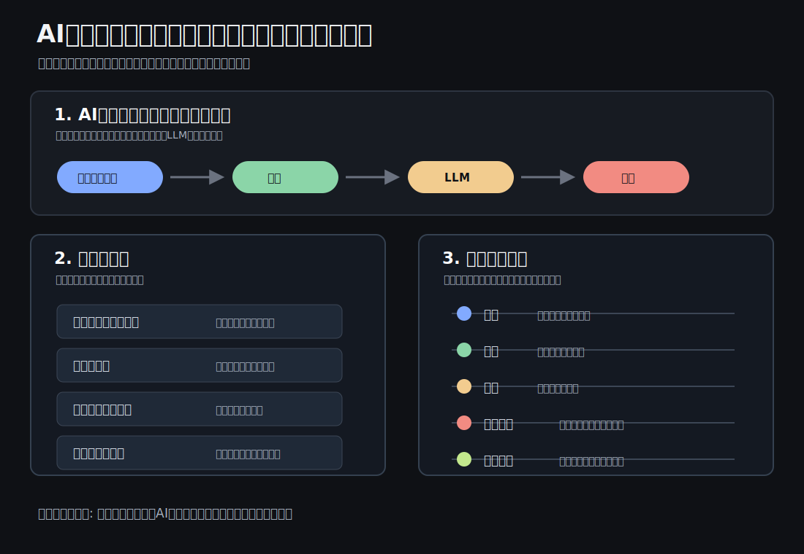

# AIチャットボットは何を覚え、何を忘れるのか

ChatGPT、Copilot、Claude、Geminiを使う人のためのAIチャット入門

## はじめに

ChatGPT、Microsoft Copilot、Claude、Gemini。

名前は違っても、利用者から見るとどれも「質問すると自然な文章で返してくれるAIチャットボット」に見えます。

ただし、実務で使うとすぐに違和感が出ます。

昨日話したことを覚えているように見える時もあれば、まったく覚えていない時もある。大量の資料を入れたのに、肝心な前提を落とすこともある。丁寧に聞いたつもりでも、期待と違う答えが返ってくることもある。

これは単なる使い方の問題ではありません。

**AIチャットボットは、人間のように「全部を理解して記憶している」わけではない**からです。

本稿では、AIチャットボットを日常や仕事で使う人が最低限押さえておきたい、基本的な仕組みを整理します。

## 先に結論

AIチャットボットの成果を決めるのは、製品名だけではありません。

重要なのは、次の組み合わせです。

- いま入力された文脈
- 保存された情報
- 参照できる社内データや過去チャット
- 指示の明確さ
- 出力後の検証

つまり、AI活用の本質は

**「良いツールを選ぶこと」ではなく、「AIが判断できる状態に仕事を設計すること」**

にあります。

AIチャットボットは、魔法の相談相手ではありません。

より正確には、**与えられた文脈をもとに、次に来るべき出力を組み立てるシステム**です。

だからこそ、文脈の渡し方、情報の整理、プロンプトの設計、検証の仕組みが重要になります。

## AIチャットボットの共通構造

多くのAIチャットボットの中核には、LLM、つまり大規模言語モデルがあります。

LLMは、人間のように文章を「読んで理解している」と表現されることがあります。しかし、実務上は次のように捉えるほうが安全です。

**LLMは、入力されたテキストの流れから、次に来る可能性が高い出力を組み立てるモデルです。**

その裏側では、文章はそのまま処理されるのではなく、トークンという単位に分解されます。トークンは、単語、単語の一部、記号、空白などを含む、AIが処理するための単位です。

そして現代のLLMの多くは、Transformerという構造を土台にしています。Transformerの重要な考え方は、文章の中で「どの情報に注目すべきか」を計算することです。

たとえば、

> 佐藤さんは資料を確認した。彼は気になる点を3つ指摘した。

という文章があった時、「彼」が誰を指すのかは、前後の文脈を見なければ判断できません。

この「前後の情報を見て、関係の強い部分に注目する」仕組みが、AIチャットボットの自然な文章生成を支えています。

ただし、ここで重要なのは、LLMが常に正しい理解をしているわけではないことです。

**LLMは強力な文章生成エンジンですが、事実確認エンジンそのものではありません。**

## チャットは「会話」ではなく「文脈つきの入力」である

AIチャットボットは、人間と会話しているように見えます。

しかし裏側では、多くの場合、次のような情報がまとめてモデルに渡されています。

- システム側のルール
- ユーザーの入力
- これまでの会話
- 添付資料や検索結果
- 出力形式の指定

つまり、チャットとは

**過去のやりとりを含んだ「文脈つきの入力」**

です。

ここを誤解すると、「さっき言ったのに、なぜ忘れるのか」という不満が起きます。

AIチャットボットは、会話履歴を常に無限に持っているわけではありません。現在の会話であっても、長くなりすぎれば要約されたり、古い情報が参照されにくくなったりします。

APIの世界では、テキスト生成リクエストは基本的に独立したものとして扱われ、会話状態は過去メッセージを文脈として渡すことで管理されます。

これは非エンジニアにも重要な理解です。

**AIが覚えているように見えるものの多くは、実際には「いま文脈として渡されているもの」です。**

## なぜ覚えている時と忘れる時があるのか

AIチャットボットの「記憶」は、ひとつではありません。

実務では、少なくとも次の4種類に分けて考える必要があります。

| 種類 | 何を意味するか | 実務上の注意 |
|---|---|---|
| 現在のチャット文脈 | いま開いている会話内で参照される情報 | 長くなると重要情報が埋もれる |
| 保存メモリ | 好み、役割、継続的な前提などとして保存される情報 | 巨大な資料や正確なテンプレート保管には向かない |
| 過去チャット参照 | 以前の会話から関連情報を参照する機能 | 製品、設定、プラン、地域で挙動が変わる |
| 仕事データ接続 | メール、文書、会議、社内ファイルなどへの接続 | 権限、契約、設定の影響を受ける |

製品ごとに表現は違います。

| 製品例 | 記憶・文脈に関係する代表機能 |
|---|---|
| ChatGPT | メモリ、過去チャット参照、Temporary Chat |
| Microsoft Copilot | Microsoft 365文脈、Graphや仕事データ、会話履歴、Copilot Memory |
| Claude | Projects、Project knowledge、RAG |
| Gemini | Saved info、past chats、長いコンテキスト |

ここで大切なのは、どの製品が優れているかを単純比較することではありません。

**「このAIは何を参照して答えているのか」を確認することです。**

特に企業利用では、テナント設定、契約プラン、地域、管理者設定によって使える機能が変わります。経営判断や顧客向け提案に使う場合は、「この回答は何を根拠にしているのか」「どのデータにアクセスできる状態なのか」を確認する必要があります。

## コンテキストは大きければよいわけではない

AIチャットボットを使い始めると、多くの人がこう考えます。

> できるだけ多くの資料を入れれば、より正確になるはずだ。

半分は正しいです。

文脈が少なすぎれば、AIは前提を推測します。推測が増えれば、誤答や一般論が増えます。

しかし、文脈が多ければ多いほど正確になる、というわけでもありません。

コンテキストウィンドウとは、モデルが一度に扱える情報量の上限です。入力、出力、一部モデルの推論用トークンまで含めて、この範囲に収める必要があります。

ここでいうトークンは、文字数そのものではありません。

OpenAIの説明では、英語の場合はおおよそ1トークンが4文字程度、100トークンが75語程度の目安とされています。日本語は分かち書きがないため単純換算しにくく、文章の内容や記号の使い方によって変わります。

実務感覚としては、次のように捉えると分かりやすいです。

| 目安 | 読者向けの感覚 |
|---|---|
| 数百トークン | 短いメール、依頼文、簡単な議事メモ |
| 数千トークン | 数ページ分の資料、短めの議事録、レポートの一部 |
| 数万トークン | 長めのレポート、複数資料、会議録と補足資料のセット |

つまり、コンテキストが大きいモデルなら「長い資料を入れられる」ようにはなります。

しかし、それは「全部を同じ精度で読んで、重要箇所を必ず拾う」という意味ではありません。

さらに、長い文脈を入れた時に、モデルがすべての情報を均等に使えるとは限りません。研究では、重要情報が長い入力の中央付近にあると性能が落ちる場合があることも示されています。

つまり、実務上の教訓は明確です。

**資料を丸ごと入れるより、何を見て、何を判断してほしいのかを整理して渡す。**

長い文脈は武器になります。

ただし、整理されていない長文はノイズにもなります。

<p></p>

## プロンプトは質問文ではなく、仕事の設計図である

プロンプトという言葉は、単なる「AIへの質問文」として扱われがちです。

しかし実務では、プロンプトはもっと重要です。

**プロンプトは、AIに仕事を渡すための設計図です。**

良いプロンプトには、少なくとも次の要素があります。

- 役割: どの立場で考えるのか
- 目的: 何を達成したいのか
- 前提: どの情報を使うのか
- 制約: 何をしてはいけないのか
- 判断基準: 何を良い答えとするのか
- 出力形式: 表、箇条書き、ドラフト、論点整理など

たとえば、単に

> この資料をレビューして

と頼むより、

> あなたは読み手にわかりやすく伝える編集者です。添付の資料を、わかりやすさ、抜け漏れ、事実確認が必要な点、次に直すべき点の4観点でレビューしてください。出力は、良い点、直すべき点、確認が必要な点の3つに分けてください。

と頼むほうが、仕事として成立しやすくなります。

違いは、AIの能力ではありません。

**仕事の渡し方です。**

## Markdownが効く理由

AIチャットボットに長めの依頼をする時、Markdownは非常に有効です。

Markdownは、見出し、箇条書き、表、引用、コードブロックなどを使って、文章を軽く構造化する書き方です。

人間にも読みやすく、AIにも文脈の区切りを伝えやすい。

たとえば、次のように書けます。

```markdown
## 目的
会議で使うため、資料のわかりにくい点を洗い出したい。

## 前提
- 読み手はこのテーマに詳しくない
- 10分で説明する資料にしたい
- 専門用語はできるだけ減らしたい

## 出力形式
| 気になる点 | なぜ問題か | 確認すべきこと | 修正案 |
```

このように書くと、AIは「どこが目的で、どこが前提で、どこが出力形式か」を判別しやすくなります。

Markdownはエンジニアだけのものではありません。

**AIに仕事を正しく渡すための、非エンジニア向けの実務フォーマットでもあります。**

## 追加で知っておくべき技術要素

ここまでを押さえた上で、次の言葉も知っておくとAIチャットボットの実務活用を理解しやすくなります。

### RAG

Retrieval Augmented Generationの略です。

モデルにすべてを覚えさせるのではなく、必要な時に社内文書やナレッジベースから関連情報を検索し、その情報を文脈として渡して回答させる考え方です。

仕事では、過去資料、社内マニュアル、議事録、FAQ、テンプレートを扱う時に重要になります。

### Embeddings

文章の意味を数値化し、似た意味の文書を探しやすくする技術です。

キーワード検索では見つからない「意味として近い資料」を探す時に使われます。

### Tool use / Agents

AIが文章を返すだけでなく、検索、計算、ファイル操作、外部システム呼び出しなどを行う仕組みです。

ただし、エージェント化すると便利になる一方で、権限、ログ、失敗時の責任分界が重要になります。

### Evaluation

AI活用では、使ってみた印象だけでは不十分です。

同じ入力で安定して良い結果が出るか、重要な失敗パターンは何か、どの程度人間の確認が必要かを評価する必要があります。

### Hallucination

AIがもっともらしい誤答を出す現象です。

これは「たまに起きるバグ」ではなく、生成AIを日常や仕事で使う上で常に意識すべきリスクです。

## 日常と仕事ではどう使うか

AIチャットボットは、特別な専門職だけの道具ではありません。

日常の調べ物、文章作成、メール、会議メモ、学習、資料整理など、いろいろな場面で使えます。

たとえば、調べ物では、AIに「調べて」と投げるだけでなく、何を知りたいのか、どの範囲まで調べたいのか、どの観点で比べたいのかを伝えます。

文章作成では、AIに「良くして」と頼むだけでなく、読み手、目的、文章の長さ、トーンを指定します。

会議メモでは、単なる要約ではなく、決定事項、未決事項、担当者、次に確認することに分けます。

学習では、ただ答えを聞くのではなく、初心者向けの説明、具体例、確認問題、間違いやすい点を出してもらいます。

旅行や買い物の検討では、候補を出してもらうだけでなく、条件、予算、優先順位、避けたいことを伝えます。

AIチャットボットは、作業者にもなります。

しかし、より大きな価値は、**思考の壁打ち相手、レビュー担当、論点整理役として使えること**にあります。

一方で、便利だからこそ注意も必要です。

AIが作った文章は、見た目が整っているほど危険です。事実が間違っていても、根拠が弱くても、もっともらしい表現で出てくることがあります。

特に注意すべきなのは、次のような場面です。

- 健康、お金、法律、契約など重要な判断に関わる時
- 個人情報や会社の機密情報を入力する時
- AIの出力をそのまま人に送る時
- 出典や根拠が確認できていない時
- 「最後に誰が確認したのか」が曖昧な時

AIチャットボットは、論点を広げたり、初稿を作ったり、抜け漏れを探したりするには強力です。

しかし、**事実確認、機密管理、最終判断、説明責任までAIに渡してはいけません。**

大事な場面で使うなら、出力をそのまま信じるのではなく、根拠確認、出典確認、数字の見直し、個人情報の扱い、人間による最終確認をセットにする必要があります。

## 今日からできること

最初から高度なAI活用を目指す必要はありません。

まずは、次の4つを徹底するだけで成果は変わります。

1. 重要情報を冒頭と末尾に置く
2. 長文資料は丸投げせず、目的・観点・優先順位を添える
3. Markdownで目的、前提、制約、出力形式を分ける
4. 重要判断では、根拠確認と人間のレビューを残す

AIチャットボットは、良い入力に対して強いツールです。

逆に、曖昧な依頼、散らかった資料、未定義の判断基準に対しては、もっともらしい一般論を返しがちです。

だからこそ、これから必要なのは、単なるAI操作スキルではありません。

**AIが判断しやすい形に、仕事そのものを構造化する力です。**

## まとめ

ChatGPT、Copilot、Claude、Geminiは、それぞれ機能も接続先も違います。

しかし、実務で押さえるべき原理は共通しています。

- AIは、いま渡された文脈に強く依存する
- 記憶には種類があり、製品や設定で挙動が変わる
- 長いコンテキストは有効だが、整理されていなければノイズになる
- プロンプトは質問文ではなく、仕事の設計図である
- Markdownは、AIに構造を伝える実務フォーマットである
- 重要な判断では、検証と人間の最終確認が必要である

AIチャットボットを使いこなすとは、単に便利な質問を覚えることではありません。

**人間の仕事を、AIが扱える構造に変換することです。**

この差が、これからの知識労働の生産性を分けていきます。

## 参考情報・出典

### 公式資料

- OpenAI, [Conversation state](https://developers.openai.com/api/docs/guides/conversation-state)
- OpenAI, [Memory FAQ](https://help.openai.com/en/articles/8590148-memory-in-chatgpt-remembering-what-you-chat-about)
- OpenAI, [What are tokens and how to count them?](https://help.openai.com/en/articles/4936856-what-are-tokens-and-how-to-count-them)
- OpenAI, [Prompting](https://developers.openai.com/api/docs/guides/prompting)
- Microsoft Support, [How Microsoft 365 Copilot Chat history works](https://support.microsoft.com/en-us/topic/how-microsoft-365-copilot-chat-history-works-6ea899e3-3bb1-450a-a2ae-220341ac193a)
- Anthropic Help Center, [What are projects?](https://support.anthropic.com/en/articles/9517075-what-are-projects)
- Google Gemini Apps Help, [Save info and reference past chats in Gemini Apps](https://support.google.com/gemini/answer/15637730)
- Google AI for Developers, [Long context](https://ai.google.dev/gemini-api/docs/long-context)
- Google AI for Developers, [Prompt design strategies](https://ai.google.dev/gemini-api/docs/prompting-intro)

### 研究・技術背景

- Vaswani et al., [Attention Is All You Need](https://arxiv.org/abs/1706.03762)
- Liu et al., [Lost in the Middle: How Language Models Use Long Contexts](https://arxiv.org/abs/2307.03172)

### Markdown仕様

- CommonMark, [A strongly defined, highly compatible specification of Markdown](https://commonmark.org/)
- GitHub, [GitHub Flavored Markdown Spec](https://github.github.com/gfm/)
