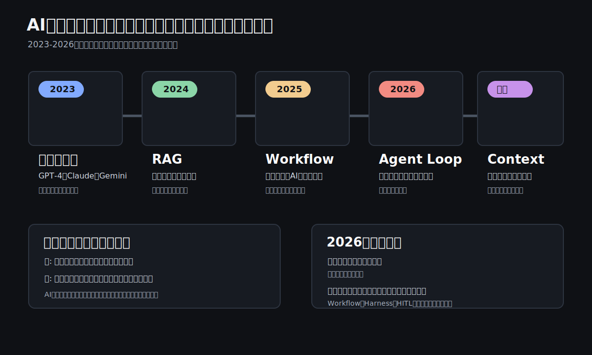

# 2026年時点のAIトレンドをビジネス視点で整理する

ここ2年で、AI活用の主戦場は大きく変わりました。

2023年から2024年にかけては、話題の中心は「どのLLMが賢いか」でした。GPT-4、Claude、Geminiのようなモデルそのものの性能、コンテキスト長、RAGによる社内文書検索が注目されました。

しかし2025年から2026年にかけて、焦点はモデル単体から、AIをどう業務に組み込むかへ移っています。



いま重要なのは、AIに一回質問して終わることではありません。

AIにどの情報を見せるか。どの手順で作業させるか。どこで人間が承認するか。失敗したときにどう止めるか。

つまりAI活用は、**チャットの使い方から、業務システムの設計へ移っている**ということです。

## 年表で見るAI活用の変化

| 時期 | 主役 | 何が変わったか |
|---|---|---|
| 2023年 | Prompt Engineering / 単発LLM | 良い質問を書けば、AIが良い回答を返すという使い方が中心 |
| 2024年 | RAG / ファイル検索 | 社内文書や外部情報を検索して、根拠をもとに回答する使い方が広がった |
| 2025年 | Workflow | AIを業務手順の中に組み込み、分類、抽出、作成、承認をつなげる使い方が増えた |
| 2026年 | Agent / Agent Loop | AIが計画、実行、観察、修正を繰り返し、長い作業を進める方向に進んだ |
| 現在 | Context Engineering / Harness / HITL | AIに何を見せ、どう制御し、どこで人間が止めるかが重要になった |

この流れを一言でいうと、**AIは「賢い回答者」から「管理された作業者」へ変わっている**ということです。

## 第1世代: 単発LLM

単発LLMは、もっとも基本的なAIチャットの形です。

```text
質問
 ↓
LLM
 ↓
回答
```

ChatGPTに質問して、文章で回答をもらう使い方がこれです。

### できること

- 文章の要約
- メールや議事録のドラフト
- アイデア出し
- 翻訳や言い換え
- 簡単な調査観点の整理

### できないこと

- 社内の最新情報を勝手に探す
- 長い業務を最後まで安定して進める
- 過去の会話や資料を常に正確に覚える
- 外部システムを操作する

### 不得意なこと

単発LLMは、短い作業には強い一方で、長い作業や複数ステップの業務には弱いです。

たとえば「この資料を読んで要約して」は得意ですが、「顧客を調べ、競合を比較し、提案書を作り、不足情報を再調査して完成させて」は不安定になります。

## 第2世代: RAG / ファイル検索

RAGは、検索で見つけた情報をAIに渡して回答させる仕組みです。

```text
質問
 ↓
検索
 ↓
LLM
 ↓
回答
```

NotebookLM、Copilotの知識検索、社内文書検索型チャットはこの考え方に近いです。

### できること

- 社内文書をもとに回答する
- PDFや議事録から該当箇所を探す
- 根拠資料を引用する
- 最新資料を参照して要約する
- 過去資料を横断して類似情報を探す

### できないこと

- 資料に書かれていないことを正しく補う
- 散らかった資料を自動で正しい社内知識に変える
- 権限や機密情報の扱いを勝手に判断する
- 業務を実行する

### 不得意なこと

RAGは、検索対象の品質に強く依存します。

ファイル名、版数、顧客名、案件名、メタデータが乱れていると、AIの回答も不安定になります。RAGは「資料を探して渡す仕組み」であって、ナレッジマネジメントそのものではありません。

## 第3世代: Workflow

Workflowは、AIを業務手順の中に組み込む考え方です。

```text
Step1
 ↓
Step2
 ↓
Step3
 ↓
結果
```

たとえば、問い合わせ対応なら次のようになります。

```text
メール受信
 ↓
分類
 ↓
必要情報取得
 ↓
返信ドラフト
 ↓
承認
```

### できること

- 定型業務を安定して処理する
- 作業手順を明確にする
- テストしやすくする
- 監査しやすくする
- 人間の承認を途中に入れる

### できないこと

- 想定外の業務を自由に解決する
- 目的だけを渡して完全自律で進める
- 業務設計なしに成果を出す

### 不得意なこと

Workflowは、決まった手順には強いですが、状況に応じて大きくやり方を変える仕事には弱いです。

ただし企業利用では、この弱さはむしろ利点でもあります。勝手に判断しすぎないため、業務システムに組み込みやすいからです。

## 第4世代: Agent

Agentは、目標を与えると、AIが計画を立てて作業を進める考え方です。

```text
目標
 ↓
計画
 ↓
実行
 ↓
再計画
 ↓
実行
 ↓
終了
```

たとえば「新規顧客を調査して提案のたたき台を作って」と依頼すると、検索、資料作成、不足情報の発見、再検索、資料更新を自律的に行うイメージです。

### できること

- 複数ステップの作業を進める
- 途中で不足情報を見つける
- 必要に応じてツールを使う
- 調査、整理、作成をまとめて行う

### できないこと

- 常に正しい判断をする
- 企業ルールを暗黙に守る
- コストや時間を自然に最適化する
- 重要な意思決定を任せきる

### 不得意なこと

Agentは自由度が高い分、暴走、コスト増、再現性の低さが問題になります。

同じ依頼でも毎回違う進め方をすることがあります。企業で使う場合は、どこまで任せるか、どこで止めるかを明確にする必要があります。

## 第5世代: Agent Loop

Agent Loopは、Agentが一度作業して終わるのではなく、計画、実行、観察、反省、再計画を繰り返す考え方です。

```text
Plan
 ↓
Act
 ↓
Observe
 ↓
Reflect
 ↓
Plan
```

コード生成ツールでよく見られる動きです。

```text
コード生成
 ↓
テスト
 ↓
失敗
 ↓
原因分析
 ↓
再生成
 ↓
テスト
 ↓
成功
```

### できること

- 失敗を見て修正する
- テスト結果をもとに改善する
- 長い作業を少しずつ進める
- 人間に近い試行錯誤を行う

### できないこと

- 無限に安く回る
- 失敗の原因を常に正しく見抜く
- 悪い方向へのループを自動で止める
- 企業リスクを自分で判断する

### 不得意なこと

Agent Loopは強力ですが、ループが長くなるほどコスト、時間、リスクが増えます。

「何回まで試すか」「どの失敗なら止めるか」「人間に確認する条件は何か」を設計しないと、便利さより危険の方が大きくなります。

## 第6世代: Multi-Agent

Multi-Agentは、複数のAIに役割を分ける考え方です。

```text
Manager Agent

├─ Research Agent
├─ Writing Agent
├─ QA Agent
└─ Review Agent
```

人間のチームに近い形で、調査担当、作成担当、確認担当を分けます。

### できること

- 作業を分担する
- 並列に進める
- レビュー役を置く
- 複数観点で品質を上げる

### できないこと

- 自動的にチームがうまく連携する
- 責任の所在を明確にする
- コストを低く抑える
- 矛盾した判断を必ず解消する

### 不得意なこと

Multi-Agentは見た目には高度ですが、実務ではオーケストレーションが難しいです。

誰が最終判断をするのか、どのAgentの回答を採用するのか、エラー時にどう戻すのかを設計しないと、複雑なだけの仕組みになります。

## 第7世代: Agent + Tool

現在のAI活用で重要なのは、LLMそのものよりも、AIがどのツールを使えるかです。

```text
Agent

├─ Web検索
├─ DB
├─ ERP
├─ GitHub
├─ Email
└─ Teams
```

AIがメール、DB、ERP、チケット管理、ファイル共有、カレンダーなどを操作できるようになると、単なる回答ではなく、業務実行に近づきます。

### できること

- 必要な情報を取りに行く
- 社内システムを参照する
- ドラフトやチケットを作る
- 作業結果を別システムへ反映する
- 人間の作業を大きく減らす

### できないこと

- 権限設計なしに安全に操作する
- 誤操作の責任を取る
- すべてのツールの仕様変更に自動対応する
- 業務ルールを勝手に理解する

### 不得意なこと

Agent + Toolは、便利さとリスクが同時に増えます。

メールを読むだけならリスクは低いですが、ERPを更新する、顧客へ送信する、契約情報を書き換えるとなると、承認、ログ、ロールバックが必須です。

## 第8世代: Agent + Harness

Harnessは、AIを安全に動かすための枠組みです。

```text
Agent
 ↓
Guardrail
 ↓
Validator
 ↓
Retry
 ↓
HITL
 ↓
Commit
```

考え方はシンプルです。

AIをもっと賢くするだけではなく、**AIが失敗しても壊れない仕組みを作る**ということです。

### できること

- 禁止行為を止める
- 出力を検証する
- 失敗時にやり直す
- 人間承認を入れる
- 実行ログを残す
- 本番反映前にチェックする

### できないこと

- すべての失敗を完全に防ぐ
- 曖昧な業務判断を自動で正解にする
- 設計なしに安全性を保証する

### 不得意なこと

Harnessは、AI活用を少し重くします。

承認や検証を入れるため、スピードは落ちます。しかし企業ITでは、この重さが重要です。速いが危ないAIより、少し遅くても壊れないAIの方が導入しやすいからです。

## 第9世代: Context Engineering

Prompt Engineeringは、AIにどう指示を書くかの技術でした。

Context Engineeringは、AIに何を見せるかの設計です。

```text
ユーザ情報
+
過去会話
+
関連文書
+
実行履歴
+
組織ルール
```

これらを組み立ててからLLMに渡します。

### できること

- 必要な情報だけをAIに渡す
- 過去の作業履歴を活用する
- 社内ルールを反映する
- ユーザーや業務ごとに回答を変える
- 長い作業の文脈を維持する

### できないこと

- 無限の情報を全部渡す
- 間違った文脈を自動で正す
- 古い情報と新しい情報を必ず見分ける
- 機密情報の扱いを勝手に最適化する

### 不得意なこと

Context Engineeringは、情報の選び方を間違えると逆効果です。

関係ない情報を渡しすぎると、AIは迷います。必要な情報が抜けると、AIは推測します。つまり、AIの品質はモデルだけでなく、渡す文脈の品質で決まります。

## 企業で見るべき結論

企業ITでは、完全自律Agentをいきなり本番業務に入れるより、**Workflow + HITL**の方が現実的です。

たとえばD365のような業務システムを更新するなら、次のような形が安全です。

```text
申請
 ↓
Agent
 ↓
差分作成
 ↓
承認
 ↓
本番反映
```

AIに作業させる。ただし、最後は人間が承認する。

この形なら、スピードと安全性のバランスを取りやすくなります。

## 小規模事業や個人では違う

一方で、小規模事業や個人起業では、より自律的なAgentが効きます。

```text
Agent
 ↓
Loop
 ↓
Tool
 ↓
自動実行
```

理由は、失敗コストが比較的低く、人手が足りず、スピードが最優先になりやすいからです。

同じAI技術でも、大企業と小規模事業では最適解が違います。

## まとめ

2023年は、良いプロンプトを書く時代でした。

2024年は、RAGで資料を検索して答える時代でした。

2025年は、Workflowで業務にAIを組み込む時代になりました。

2026年は、Agent、Loop、Tool、Harness、HITL、Context Engineeringを組み合わせる時代です。

そしてこれからの競争軸は、**どのモデルが一番賢いか**だけではありません。

より重要なのは、**どれだけ長時間、低コスト、安全にAIのループを回せるか**です。

AI活用は、個人の便利ツールから、業務設計、システム設計、ガバナンス設計の領域へ移っています。
