# 2026年時点のAIトレンドまとめ

AIの競争軸は、モデルの賢さだけでは語れなくなってきました。

2023年から2024年にかけては、まずLLMそのものの性能競争が中心でした。LLMはLarge Language Model、大規模言語モデルのことです。GPT-4、Claude、Gemini。どのモデルが賢いのか、どれだけ長いコンテキストを扱えるのか。そこにRAGブームも重なっていました。

でも、2025年から2026年にかけて、見るべき場所は少しずつ移っています。

モデル単体の性能ではなく、AIをどうシステムとして動かすか。エージェント、ワークフロー、ループ、ハーネス、コンテキスト管理。いま差が出始めているのは、このあたりです。

## 単発LLMの時代

最初の形はかなりシンプルでした。

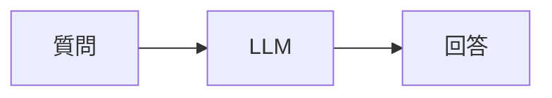

ChatGPTそのものです。

代表例は、ChatGPT、Claude、Geminiのようなチャット型AIです。画面に質問を入れて、返ってきた文章を読む。この体験が、まずAIを一気に身近なものにしました。

質問すると、LLMが答える。使いやすくて、安定していて、コストも比較的安い。多くの人にとって、AIとの最初の接点はこの形だったと思います。

ただ、この形には限界もあります。長い作業を任せにくい。外部ツールを使えない。記憶もない。つまり、その場の一問一答には強いけれど、仕事を継続的に進めるには足りない。

## RAGで知識を取りに行く

次に広がったのがRAGです。RAGはRetrieval-Augmented Generationの略で、ざっくり言うと「検索してから答える」仕組みです。

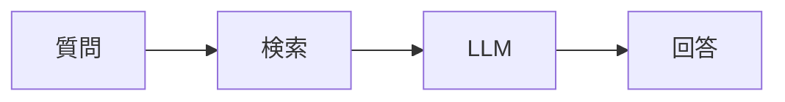

NotebookLMやCopilotの知識検索は、この流れに近いです。

分かりやすい製品例は、Google NotebookLMとMicrosoft 365 Copilotです。自分の資料や社内文書を読ませて、その内容をもとに要約や回答を出す。単なる雑談AIから、知識検索の道具に近づいた段階です。

社内文書や最新情報を検索し、その結果をLLMに渡して回答させる。2024年は、この考え方がかなり主流でした。LLM単体に全部覚えさせるのではなく、必要な情報を外から持ってくるわけです。

これは今でも外せません。ただ、RAGだけで業務が全部回るわけではありません。情報を探せても、その後の作業をどう進めるかは別問題だからです。

## 実務ではWorkflowが強い

いま実務で一番使いやすいのは、むしろWorkflowです。ここでいうWorkflowは、AIに自由に考えさせるというより、決まった手順の一部にAIを組み込む考え方です。

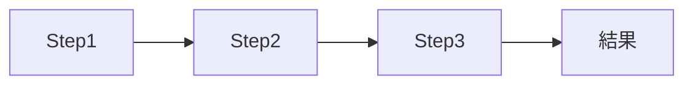

たとえばメール対応なら、こういう流れになります。

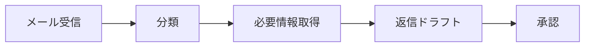

これは派手ではありません。でも、現場では強い。

製品でいうと、Microsoft Power Automate、Zapier、Makeのような自動化ツールにAIが入ってくるイメージです。メール、フォーム、CRM、承認フローをつなぎ、その一部をLLMに任せる。企業の現場では、このくらい制御された形の方が入りやすい。

理由ははっきりしています。再現性が高く、テストしやすく、監査もしやすい。企業で使うなら、この性質はかなり大きいです。MicrosoftやOpenAIが実際に推している方向も、かなりの部分はこのWorkflow寄りだと思います。

AIに全部を自由にやらせるのではなく、決まった流れの中でAIを使う。現場に入るAIは、まずここから広がっています。

## Agentは話題の中心にいる

もちろん、いま一番話題になりやすいのはAgentです。Agentは、ユーザの目標を受け取って、自分で手順を考え、必要な作業を進めるAIのことです。

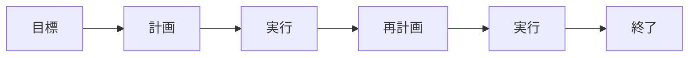

たとえば「新規顧客を調査して」と頼むとします。

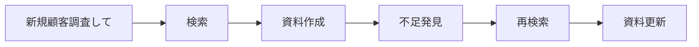

ここでは、AIが自分で計画を立て、検索し、資料を作り、不足を見つけ、また調べ直します。単発の回答ではなく、作業そのものに近づいている。

この柔軟さがAgentの魅力です。

目立つ例としては、Devin、Manus、ChatGPTのタスク実行系機能のようなものがあります。ユーザが細かい手順を全部書かなくても、AIが途中の作業を分解して進める。この見た目の分かりやすさが、Agentを一気に話題にしました。

ただし、欠点もはっきりしています。暴走しやすい。コストが高い。再現性が低い。デモでは面白く見えても、企業の本番業務にそのまま入れるにはまだ怖い場面が多いです。

## Agent Loopが現実味を持ち始めた

最近の流れで大事なのは、単なるAgentではなくAgent Loopです。Loopというのは、AIが一回作業して終わるのではなく、結果を見て、直して、また試す繰り返しのことです。

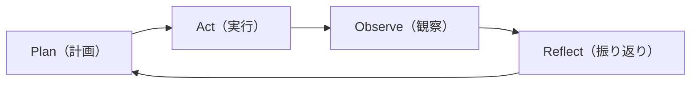

計画して、実行して、観察して、振り返り、また計画する。このループを回す形です。

コード生成で見ると分かりやすいです。

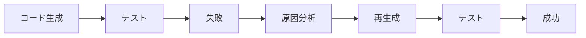

CodexやClaude Codeは、かなりこの形に近いです。

代表例は、Codex、Claude Code、Cursor Agentです。コードを書いて終わりではなく、テストを走らせ、失敗を読み、修正し、また試す。ソフトウェア開発では、このループ構造がかなり分かりやすく出ています。

一度答えて終わりではなく、失敗を見て、直して、また試す。人間の作業に少し近い動き方になってきています。

## Multi-Agentは役割分担の発想

もう一つ増えているのがMulti-Agentです。これは複数のAgentに役割を分けて、ひとつの仕事をチームのように進める発想です。

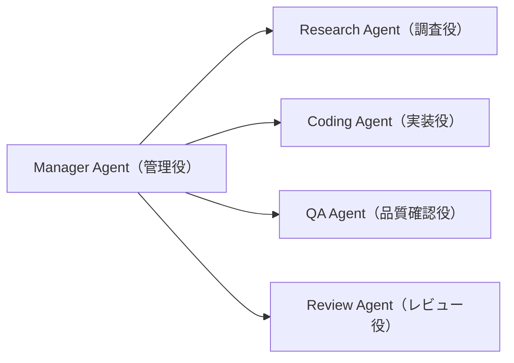

Manager Agentの下に、Research Agent、Coding Agent、QA Agent、Review Agentのような役割を置く。人間のチーム編成に近い考え方です。

製品やフレームワークでは、Microsoft AutoGen、CrewAI、LangGraphを使った構成がこの発想に近いです。ひとつの巨大なAIに全部やらせるのではなく、調査役、実装役、レビュー役に分ける。見方を変えると、AIの中に小さな組織を作っているようなものです。

うまく回れば品質は上がりますし、並列実行もできます。

ただ、ここにも難しさがあります。コストは増えます。オーケストレーションも大変です。Agentを増やせば賢くなる、というほど単純ではありません。

## 本命はAgent + Tool

現在の本命は、Agent + Toolだと思います。Toolは、AIが外部のソフトやデータに触るための道具です。検索、データベース、業務システム、メール、チャットなどがここに入ります。

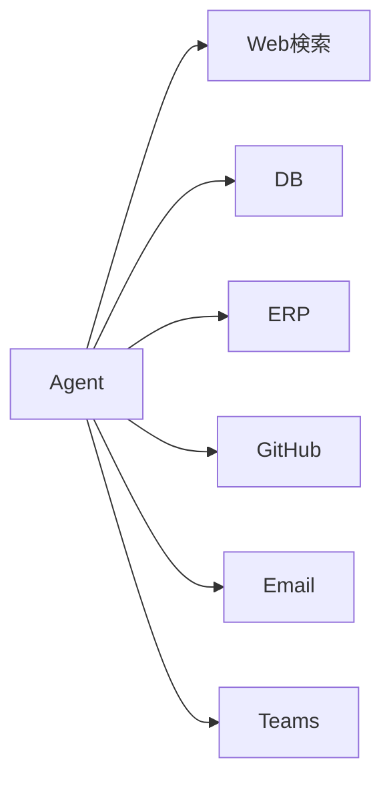

ここで効いてくるのは、LLM自体の賢さだけではありません。

**ツールをどれだけ使えるか。**

ここがかなり大きくなっています。Web検索、DB、ERP、GitHub、Email、Teams。DBはデータベース、ERPは基幹業務システムのことです。AIが現実の仕事に入るには、こうした道具を扱えないといけません。

具体例としては、GitHub Copilot Workspace、ChatGPTのコネクタ、Microsoft Copilot Studioのような製品があります。AIが文章を返すだけでなく、GitHubを見たり、メールを読んだり、業務システムに触ったりする。ここからAIは、画面の外側に出始めます。

モデル単体の知能より、周辺システムとの接続の方が効いてくる場面が増えています。

## Agent + Harnessは失敗を前提にする

最近追っている領域として、Agent + Harnessがあります。Harnessは、AIを直接走らせるのではなく、失敗を検知したり、止めたり、やり直させたりする外側の制御装置のようなものです。

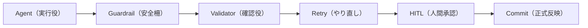

ここで目指しているのは、AIをただ賢くすることではありません。

むしろ、AIが失敗しても壊れない仕組みを作ることです。

Guardrailは危ない動きを止める仕組みです。Validatorは結果が正しいかを確認する仕組み。Retryは失敗したときのやり直しです。必要ならHITL、人間の承認を挟む。HITLはHuman in the Loop、つまり重い判断の前に人間を入れる設計です。そして最後にCommitする。ここでのCommitは、確認済みの変更を正式に反映することです。

この領域では、LangSmith、Braintrust、OpenAI Evals、Guardrails AIのような製品やツールが目立ちます。AIの出力を評価し、ログを残し、失敗を検知する。派手なチャット画面ではありませんが、本番利用ではここが効いてきます。

OpenAI、Anthropic、Microsoft。大きな流れとしては、みんなこの方向に向かっているように見えます。

## Prompt EngineeringからContext Engineeringへ

いま一番熱い領域は、Context Engineeringかもしれません。Context Engineeringは、AIに何を見せるかを設計することです。Prompt Engineeringが「どう聞くか」だとすると、Context Engineeringは「どの情報を渡すか」に近い。

昔はこうでした。

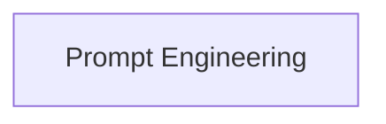

いまはこうです。

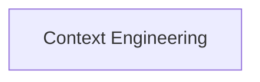

つまり、どう聞くかだけではなく、何を見せるかで差が出るようになっています。

たとえば、LLMに渡す前にこういう情報を組み立てます。

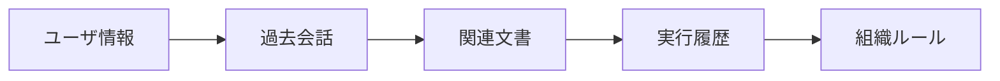

ユーザ情報、過去会話、関連文書、実行履歴、組織ルール。これらをどう選び、どう並べ、どのタイミングで渡すか。

製品例でいうと、Cursor、Claude Code、Codex、Perplexityのようなツールは、この差が体験に出やすいです。同じモデルを使っていても、どのファイルを読んでいるか、どの履歴を覚えているか、どの検索結果を混ぜているかで、答えの質が大きく変わります。

Codex、Claude Code、Cursor。みんなこの領域を見ています。プロンプトを書く力だけではなく、コンテキストを設計する力が問われるようになっています。

## 企業ITではWorkflow + HITLが現実的

企業ITの視点で見ると、正直なところ「完全自律Agent」よりWorkflow + HITLの方が現実的です。つまり、AIに下書きや差分作成は任せるけれど、承認や本番反映の前には人間を挟む形です。

たとえばD365更新なら、こういう流れの方が安全です。D365はMicrosoft Dynamics 365、営業や会計、在庫などを扱う企業向け業務システムです。

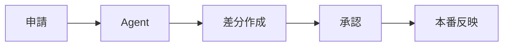

AIが差分を作る。人間が承認する。それから本番に反映する。

この方が扱いやすいです。監査もしやすいし、責任の所在も見えやすい。今年の企業導入の大半は、たぶんこちら側に寄ると思います。

## 個人起業では逆になる

一方で、個人起業や小規模チームでは話が逆になります。

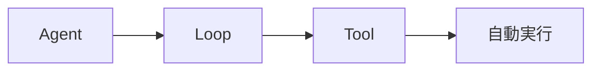

小規模なら、Agent、Loop、Tool、自動実行がかなり効きます。

理由はシンプルです。失敗コストが比較的低い。人手が足りない。スピードを優先したい。だから、多少荒くても自動で回る仕組みの価値が大きい。

企業では危ないものが、小規模では武器になることがあります。ここは分けて考えた方がいいです。

## 一枚で見ると

この流れを一枚にすると、こうなります。

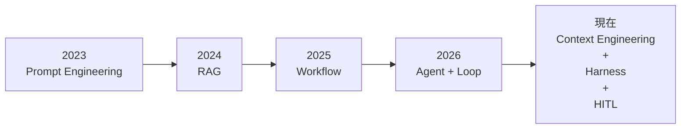

2023年はPrompt Engineering。2024年はRAG。2025年はWorkflow。2026年はAgent + Loop。そして現在は、Context Engineering、Harness、HITLに重心が移っています。

そして2026年後半の競争軸は、もう「どのモデルが賢いか」だけではありません。

**どれだけ長時間、低コスト、安全にループを回せるか。**

ここに移っています。Claude Code、Codex、OpenHands、LangGraph系が狙っているのも、まさにこの領域です。AIの成熟度は、賢い返事よりも、壊れにくい運用で測られるようになっていきます。
