# 2026年時点のAIトレンドまとめ

ここ2年で流れがかなり変わりました。

## 2023〜2024

- LLMそのものの性能競争
- GPT-4、Claude、Gemini
- コンテキスト長競争
- RAGブーム

⬇

## 2025〜2026

- モデル単体より「システム化」
- エージェント
- ワークフロー
- ループ
- ハーネス
- コンテキスト管理

が主戦場になっています。

## 第1世代：単発LLM

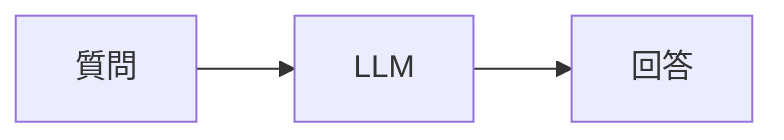

ChatGPTそのもの。

特徴

- シンプル
- 安定
- 安い

限界

- 長い作業が苦手
- ツール利用不可
- 記憶がない

## 第2世代：RAG

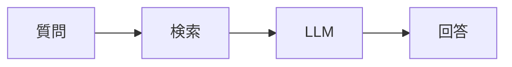

NotebookLMやCopilotの知識検索。

特徴

- 社内文書利用
- 最新情報利用

2024年はこれが主流。

## 第3世代：Workflow

今はここが実務の主流。

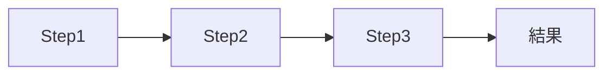

例

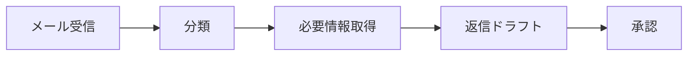

特徴

- 再現性高い
- テストしやすい
- 監査しやすい

MicrosoftやOpenAIも実際はこれを推している。

## 第4世代：Agent

話題の中心。

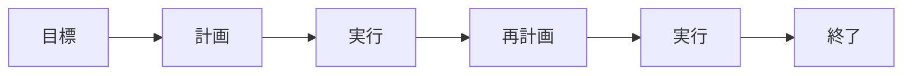

例えば

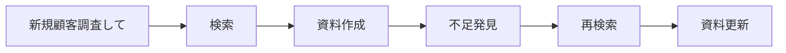

特徴

- 自律性高い
- 柔軟

欠点

- 暴走する
- コスト高い
- 再現性低い

## 第5世代：Agent Loop

最近のトレンド。

単なるAgentではなく、

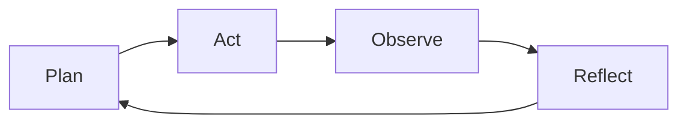

を繰り返す。

例

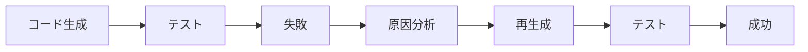

CodexやClaude Codeはほぼこれ。

## 第6世代：Multi-Agent

最近増えている。

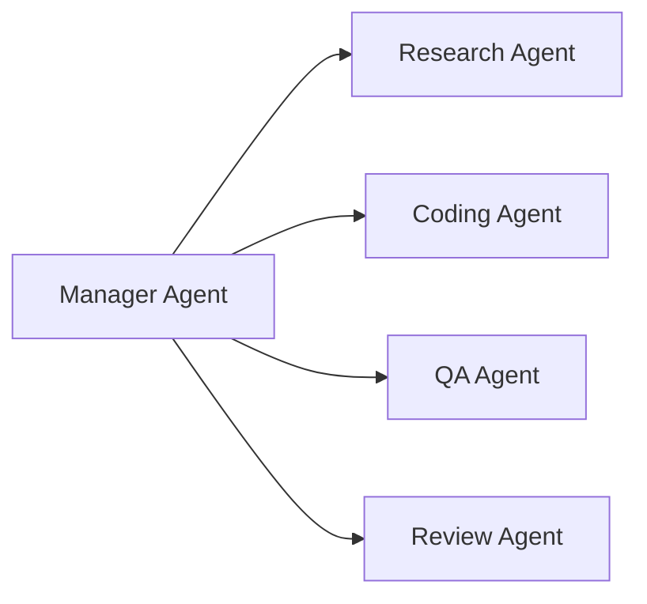

役割分担。

メリット

- 品質向上
- 並列実行

デメリット

- コスト爆増
- オーケストレーションが大変

## 第7世代：Agent + Tool

現在の本命。

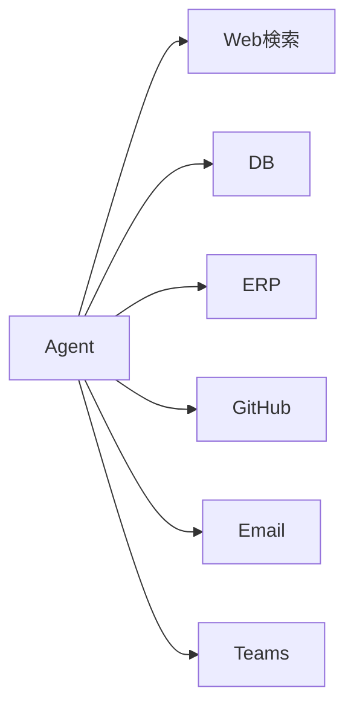

LLM自体ではなく

**ツールをどれだけ使えるか**

が重要になった。

## 第8世代：Agent + Harness

最近追っている領域。

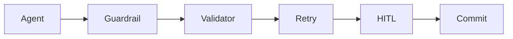

つまり

> AIを賢くする

ではなく

> AIが失敗しても壊れない

を目指す。

OpenAI、Anthropic、Microsoft。

全部この方向。

## 第9世代：Context Engineering

今もっとも熱い領域。

昔

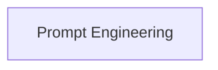

だった。

今

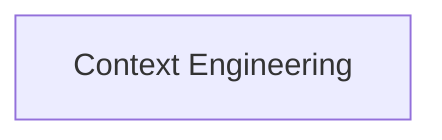

になっている。

何を見せるか

が重要。

例

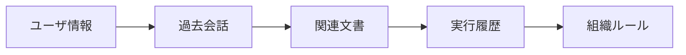

を組み立ててからLLMに渡す。

Codex、Claude Code、Cursor。

みんなここ。

## 企業IT視点

正直、

**「完全自律Agent」よりWorkflow + HITL**

です。

例えばD365更新なら

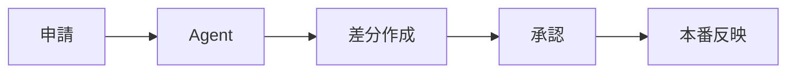

の方が圧倒的に安全。

今年の企業導入の大半はこっち。

## 個人起業視点

逆。

小規模なら

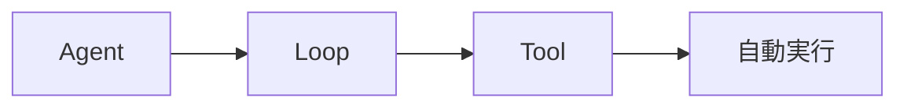

が効く。

理由は

- 失敗コストが低い
- 人手不足
- スピード優先

だから。

## 一枚でいうと

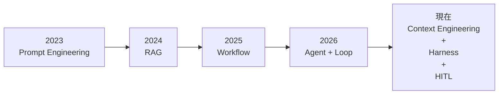

になっています。

そして2026年後半の競争軸は、

**「どのモデルが賢いか」ではなく**

**「どれだけ長時間・低コスト・安全にループを回せるか」**

に移っています。Claude Code、Codex、OpenHands、LangGraph系が全部そこを狙っています。
